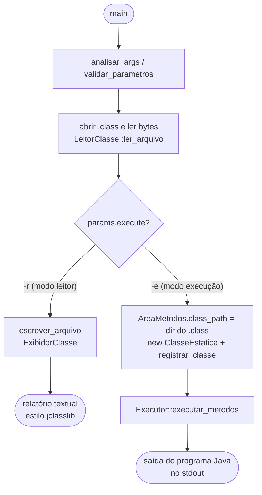

# Fluxo do Programa

Este documento descreve o fluxo de execução da JVM, relacionando cada etapa
com a terminologia dos slides da disciplina (*The Java Virtual Machine
Specification*, Lindholm & Yellin) — **Estruturas de Dados em Tempo de
Execução**, **Pilha de Frames** e o **ciclo do interpretador**.

## 1. Visão geral (dos argumentos à saída)



`ArquivoClasse` é a representação em memória do `.class` (magic, versões,
**pool de constantes**, campos, métodos, atributos) — produzida pelo
`LeitorClasse` e consumida pelos dois modos.

## 2. Modo execução — Máquina Virtual

Ao executar (`-e`), montam-se as **estruturas de dados em tempo de execução**
descritas nos slides e roda-se o **ciclo do interpretador**.

```
                 Executor::executar_metodos(ClasseEstatica*)
                                  |
     empilha Frame de <clinit> (se houver) e de main([String;)V
                                  |
                                  v
   +=========================  LAÇO DE DESPACHO  =========================+
   |  (= ciclo do interpretador dos slides)                              |
   |                                                                     |
   |   do {                                                             |
   |       Frame* f   = PilhaExecucao.frame_topo();                     |
   |       u1   opcode = f->get_code(f->pc)[0];   // busque um opcode   |
   |       (this->*tabela_funcoes[opcode])();     // busque operandos   |
   |                                              // + execute a ação   |
   |   } while (PilhaExecucao.tamanho() > 0);     // até a pilha vazia  |
   +=====================================================================+
        |                    |                         |
        | invoke*            | return                  | new / getstatic / ldc
        v                    v                         v
  empilha novo Frame   desempilha Frame e        resolve classe na ÁREA DE
  (avança o pc do      devolve o valor ao        MÉTODOS e/ou aloca objeto
  chamador ANTES)      frame anterior            no HEAP
```

### Estruturas de dados (slides ↔ código)

```
  +-------------------------------------------------------------------+
  |                     ÁREA DE MÉTODOS  (AreaMetodos)                 |
  |   cache de classes carregadas: map<string, ClasseEstatica*>       |
  |   class_path  +  carregar_classe()  (carga sob demanda)           |
  |                                                                   |
  |   ClasseEstatica  --> ArquivoClasse (Pool de Constantes, código   |
  |                       dos métodos)  +  campos_estaticos           |
  +-------------------------------------------------------------------+

  +------------------------------+     +------------------------------+
  |   PILHA DA JVM (PilhaExecucao)|    |          HEAP                |
  |   stack<Frame*>              |     |   Objeto (base):             |
  |                              |     |     ObjetoString             |
  |   +----- Frame corrente ---+ |     |     Arranjo (array)          |
  |   | pc (Registro PC)       | |     |     ClasseInstancia (campos) |
  |   | pilha de operandos     | |     +------------------------------+
  |   | vetor de variáveis     | |
  |   |   locais [0..maxlocals]| |   Variáveis locais (slide):
  |   | ref. ao Pool de Const. | |     - índice 0 = `this` (métodos
  |   |   (ligação dinâmica)   | |       de instância) ou 1º parâmetro
  |   +------------------------+ |       (métodos estáticos)
  +------------------------------+     - long/double ocupam 2 slots
```

### Formato de instrução (slides)

Cada instrução é `1 byte de opcode` + `0..N operandos` (big-endian). Operando
de 16 bits é reconstruído com `(byte1 << 8) | byte2`. Cada função de opcode é
responsável por **avançar o `pc`** — `tableswitch`/`lookupswitch` e os
`invoke*`/desvios ajustam o `pc` conforme sua semântica.

## 3. Mapa: conceito do slide → componente da implementação

| Conceito (slides)              | Implementação (arquivo)                         |
|--------------------------------|-------------------------------------------------|
| Área de Métodos                | `AreaMetodos`  ([area_metodos](src/area_metodos.cpp)) |
| Pool de Constantes (runtime)   | `ArquivoClasse::constant_pool` ([arquivo_classe.hpp](include/arquivo_classe.hpp)) |
| Pilha da JVM / Pilha de Frames | `PilhaExecucao`  ([pilha_execucao](src/pilha_execucao.cpp)) |
| Frame (var. locais, operandos) | `Frame`  ([frame](src/frame.cpp))               |
| Registro PC                    | `Frame::pc`                                     |
| Heap (objetos e arrays)        | `Objeto` / `ObjetoString` / `Arranjo` / `ClasseInstancia` |
| Classe carregada + estáticos   | `ClasseEstatica` ([classe_estatica](src/classe_estatica.cpp)) |
| Ciclo do interpretador         | `Executor::executar_metodos` + `tabela_funcoes[202]` ([executor](src/executor.cpp)) |
| Conjunto de instruções         | uma função-membro por opcode em `Executor`      |
| Carga / ligação / inicialização| `carregar_classe` + empilhamento de `<clinit>`  |
